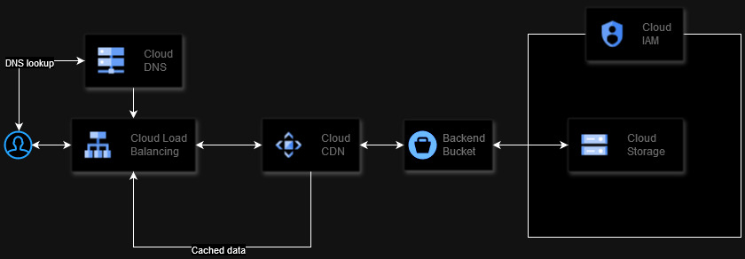

# Google Cloud Storage CDN Project

This project enables serving content from a private Google Cloud Storage bucket via Google Cloud CDN, optimized for performance and security. It integrates various Google Cloud services to deliver content globally using a custom domain.

## Key Features

- Secure storage of content in a private Google Cloud Storage bucket.
- Global caching and low-latency delivery using Google Cloud CDN.
- Http to Https redirect.
- Custom domain setup using Google Cloud Load Balancer and Google Cloud DNS.

## Test purposes disclaimer

This project is a part of test task, so it contains the self-signed certificate files unencrypted, the image of the cat from the internet and the domain name that never was purchased. This will result to the SSL issue if the certificate and the domain name will not be replaced by the proper ones.

The IAM role for the cloud bucket allows all users to read the content, so the cat picture will be available via direct link to the bucket. I tried to restrict the policy and let only CDN service to read, but the service was not created by Google during enabling CDN for unknown reason.
## GCP Services Involved

- Google Cloud Storage: Stores the content securely in a private bucket.
- Google Cloud CDN: Accelerates content delivery through caching at Google's edge locations. 
- Google Cloud Load Balancer: Provides a public endpoint for the custom domain and routes traffic to the backend bucket. 
- Google Cloud DNS: Manages DNS records for the custom domain. 
- IAM Roles and Permissions: Ensures proper access control for the private bucket.

## Diagram

## Infrastructure as a Code

The project configuration is fully automated using Terraform (tested on version v1.9.8)

## Deployment
### Before you begin:
1. Create a project in GCP or pick up existed one
2. In `teraform.tfstate` file change the variable `project_id` according to the name of your project
3. In `teraform.tfstate` file change the `region` to desired region. For example, `europe-central2`
4. (Optional) Prepare the domain name for the endpoint. Add it to the `terraform.tfstate` file as the variable `domain_name`
5. (Optional) Issue a certificate for mentioned domain name. Replace `cert.pem` and `key.pem` in the `ssl_certs` directory with the certificate file and the private key file accordingly
6. Activate the compute engine API for the project using the link: https://console.developers.google.com/apis/api/compute.googleapis.com/overview
7. Activate the DNS API for the project using the link: https://console.developers.google.com/apis/api/dns.googleapis.com/overview
8. Clone this repository or download the files and extract it
9. Go to the directory with the terraform code `cd nik-test-gcp`

### Run Terraform
1. In your console authenticate to the GCP account with `gcloud auth application-default login` command
   - Install the [gcloud CLI](https://cloud.google.com/sdk/docs/install) if you need it
2. Run `terraform init`
3. Run `terraform apply`, check the resources that will be created and type `yes` to proceed
4. After Terraform completes it's job, wait about 10 minutes while the Backend Bucket initializes
5. Check the link from the output

    - `https://[external-ip]/test.jpg` if you didn't create a domain (be ready to face SSL error and add it to the exception)
    - `https://[domain-name]/test.jpg` if you have a domain name purchased (*note that DNS routes could take about an hour to distribute the information about the domain)
    - Http requests should also redirect to https
    - You can check the [Load Balancer logs](https://console.cloud.google.com/logs?service=network.googleapis.com) to see the image was cached by CDN